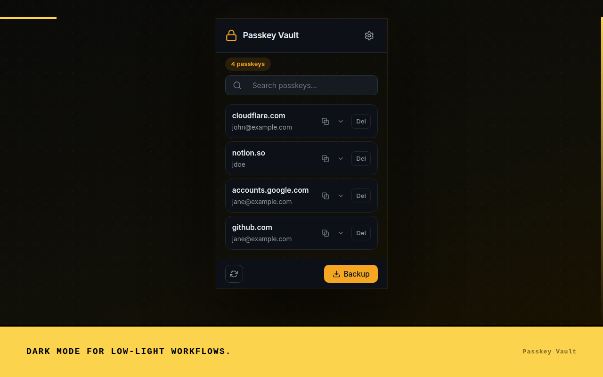
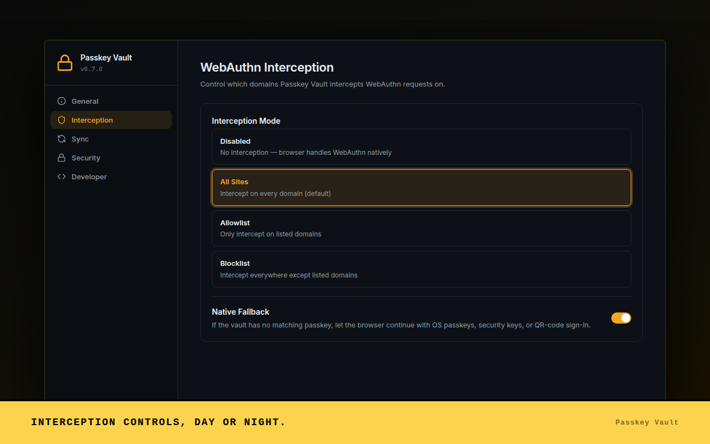

# Passkey Vault

A browser extension that intercepts WebAuthn API calls and stores passkeys locally, bypassing the browser's native passkey UI. Works on **Chrome** (MV3) and **Firefox** (MV2).

[Install from Chrome Web Store](https://chromewebstore.google.com/detail/passkey-vault/lopekoolgoijpmaidblgfgelbkfkgmod)

---

## Screenshots






---

## Features

- **WebAuthn interception** — captures `navigator.credentials.create()` and `navigator.credentials.get()` before the browser handles them
- **Local storage** — passkeys stay in browser local storage, no external server
- **TOTP / 2FA codes** — RFC 6238 generator with live codes, clipboard copy, otpauth:// import, included in backup and sync
- **Backup & import** — export all passkeys (including private keys) and TOTP entries as a JSON file, import on another device
- **Cross-device sync** — optional Nostr-based sync chain using a BIP-39 seed phrase
- **Emergency access** — standalone recovery page for vault management without the extension popup
- **Chrome + Firefox** — single codebase, separate manifests

---

## Installation

### Chrome Web Store

[Download Passkey Vault](https://chromewebstore.google.com/detail/passkey-vault/lopekoolgoijpmaidblgfgelbkfkgmod)

### Build from source

Requires Node.js 18+.

```bash
git clone https://github.com/FenkoHQ/passkey-vault.git
cd passkey-vault
npm install

npm run build          # Chrome
npm run build:firefox  # Firefox
npm run build:all      # Both
```

**Load in Chrome:**

1. Open `chrome://extensions/`
2. Enable Developer mode
3. Click "Load unpacked" → select `dist/`

**Load in Firefox:**

1. Open `about:debugging#/runtime/this-firefox`
2. Click "Load Temporary Add-on..."
3. Select `dist-firefox/manifest.json`

---

## How it works

1. A content script injects into every page and overrides the native WebAuthn API
2. On `credentials.create()`, the background script generates an ECDSA P-256 key pair, creates a valid attestation response, and stores the passkey
3. On `credentials.get()`, it signs the challenge with the stored private key using proper CBOR encoding
4. The popup reads directly from `chrome.storage.local` — no background message passing for display
5. TOTP codes are derived locally from each entry's secret using HMAC-SHA1/256/512; the popup caches the current code and refreshes it once per second when the 2FA tab is open

---

## Scripts

```bash
npm run build            # Build for Chrome
npm run build:firefox    # Build for Firefox
npm run build:all        # Build for both
npm run zip              # Build Chrome + create ZIP
npm run zip:firefox      # Build Firefox + create ZIP
npm run zip:all          # Build both + create both ZIPs
npm run clean            # Remove dist directories
npm run test             # Run tests
npm run lint             # Run ESLint
npm run typecheck        # TypeScript check
npm run version:bump     # Sync version across all manifests (run before tagging)
npm run capture          # Re-generate screenshots and demo video
```

---

## Chrome Web Store Listing

Use these fields when updating the Chrome Web Store listing for `v0.7.0`.

**Name**

Passkey Vault

**Summary**

Store and use WebAuthn passkeys locally, with backup, sync, and native browser fallback controls.

**Category**

Developer Tools

**Language**

English

**Detailed Description**

Passkey Vault is a local-first WebAuthn passkey tool for developers, testers, and advanced users who want direct control over passkey creation, storage, backup, sync, and browser fallback behavior.

The extension intercepts WebAuthn credential creation and sign-in requests, stores passkeys in the browser's local extension storage, and lets you inspect, search, export, import, and sync credentials without depending on a third-party cloud account.

Key features:

- Local passkey vault for WebAuthn create and get flows
- Default passthrough to the browser and OS passkey UI when no matching passkey is stored
- Configurable interception rules for disabled, all-sites, and allowlist modes
- Searchable popup with light and dark themes
- Backup and import workflows for moving passkeys between environments
- Optional cross-device sync using a Nostr-based sync chain
- Developer tools for console logging, storage inspection, sync protocol logs, and WebAuthn event logs

Important: Passkey Vault is intended as a research and developer tool. Private key material is stored in local browser extension storage. Treat extension data and exported backups as sensitive credential material.

What's new in `v0.7.0`:

- Added native browser fallback passthrough for sites without a stored passkey
- Added interception controls for blocking or allowing browser fallback
- Refreshed the popup, settings, import, sync, and emergency access UI
- Added light and dark theme screenshots for the Chrome Web Store listing
- Standardized the product name as Passkey Vault

**Screenshots**

Use up to five CWS screenshots in this order:

1. `docs/cws/cws-01-vault.png`
2. `docs/cws/cws-02-search.png`
3. `docs/cws/cws-03-detail.png`
4. `docs/cws/cws-07-settings-dark.png`
5. `docs/cws/cws-05-sync.png`

Additional generated screenshots are available in `docs/cws/` if the dashboard accepts more than five.

**Promotional Images**

- Small promo tile: `docs/cws/promo-small.png`
- Marquee promo tile: `docs/cws/promo-marquee.png`

**Homepage URL**

https://github.com/FenkoHQ/passkey-vault

**Support URL**

https://github.com/FenkoHQ/passkey-vault/issues

**Privacy / Single Purpose**

Passkey Vault stores and manages WebAuthn passkeys locally so users can create, retrieve, inspect, backup, sync, and control browser fallback behavior for passkeys in supported browsers.

**Privacy / Data Use**

Passkey Vault stores passkey credential material in local browser extension storage. It does not sell user data and does not send credential material to a central service. Optional sync sends encrypted sync payloads through configured Nostr relays. Because the extension intercepts WebAuthn calls on visited sites, the Chrome Web Store privacy form should disclose authentication-related data and website interaction needed for the extension's single purpose.

---

## Releasing

```bash
npm run lint
npm run typecheck
npm test
npm run build:all
npm run zip:all
npm run validate:packages
git tag v0.7.0
git push origin main
git push origin v0.7.0
```

The CI pipeline builds both extensions, publishes to the Chrome Web Store, and creates a GitHub release with both ZIPs attached.

---

## Project structure

```
src/
├── background/         # Service worker / background script
├── content/            # Content script + WebAuthn injection
├── crypto/             # BIP-39, ECDSA, AES-GCM, secure storage
├── sync/               # Nostr-based sync service
├── ui/                 # popup, options, import, sync-setup, sync-settings, emergency
├── manifest.json       # Chrome MV3
└── manifest.firefox.json
```

---

## Security

- Private keys are stored unencrypted in `chrome.storage.local`
- Export files contain private keys — treat them like passwords
- This is a research/developer tool, not a production credential manager

---

## License

MIT
