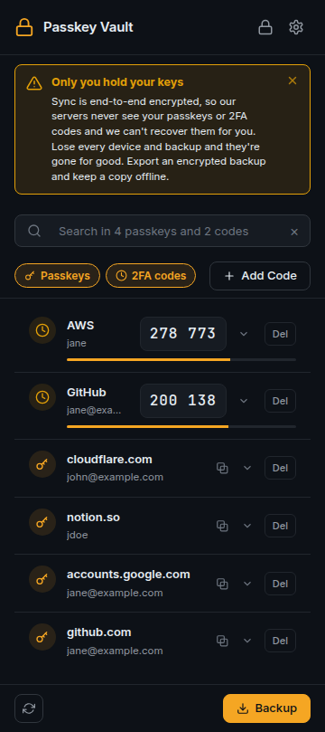
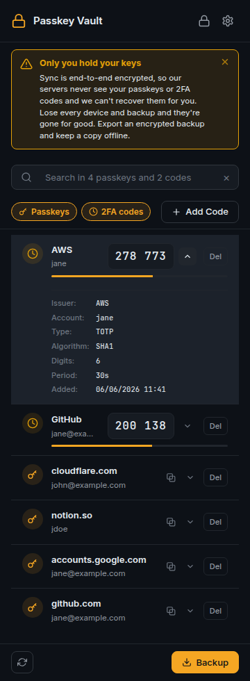
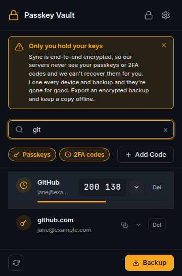
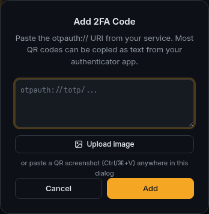
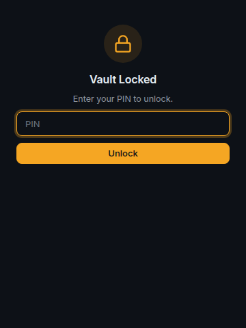

# Fenko Vault

Intercepts WebAuthn API calls and stores passkeys locally, bypassing the browser's native passkey UI. Available as a browser extension for Chromium browsers and Firefox, and as an Android passkey provider app.

## Download

| Platform | Get it | Status |
| --- | --- | --- |
| **Chrome · Edge · Brave · Opera** | [Chrome Web Store](https://chromewebstore.google.com/detail/passkey-vault/lopekoolgoijpmaidblgfgelbkfkgmod) | Available |
| **Firefox** | [Firefox Add-ons](https://addons.mozilla.org/en-US/firefox/addon/fenko-vault/) | Submitted — pending Mozilla approval, not yet live |
| **Android** | [Latest APK](https://github.com/FenkoHQ/passkey-vault/releases) | Pre-release — sideload the signed APK, [feedback welcome](https://github.com/FenkoHQ/passkey-vault/issues) |

> The Android build is an early pre-release we're shipping for testing. Expect rough edges, and please [open an issue](https://github.com/FenkoHQ/passkey-vault/issues) with bugs or suggestions. The Firefox listing is awaiting Mozilla review — the link will go live once approved.

---

## Screenshots

<table>
  <tr>
    <td align="center" valign="top" width="33%">
      
    </td>
    <td align="center" valign="top" width="33%">
      
    </td>
    <td align="center" valign="top" width="33%">
      
    </td>
  </tr>
  <tr>
    <td align="center"><sub><b>One searchable vault</b></sub></td>
    <td align="center"><sub><b>Details on every entry</b></sub></td>
    <td align="center"><sub><b>Find anything fast</b></sub></td>
  </tr>
  <tr>
    <td align="center" valign="top">
      
    </td>
    <td align="center" valign="top">
      
    </td>
    <td></td>
  </tr>
  <tr>
    <td align="center"><sub><b>Add codes by URI or QR image</b></sub></td>
    <td align="center"><sub><b>Lock behind a PIN</b></sub></td>
    <td></td>
  </tr>
</table>

---

## Features

- **WebAuthn interception** — captures `navigator.credentials.create()` and `navigator.credentials.get()` before the browser handles them
- **Local storage** — passkeys stay in browser local storage, no external server
- **TOTP / 2FA codes** — built-in RFC 6238 / 4226 authenticator with live codes, clipboard copy, and `otpauth://` import (paste a URI, paste a QR screenshot, or upload a QR image — decoded locally, no camera)
- **Unified vault** — passkeys and 2FA codes share one searchable list with per-type filters; each entry expands to show its details
- **Vault lock** — optional 4–12 digit master PIN encrypts the vault at rest and locks the popup; set, change, or remove it any time
- **Backup & import** — export all passkeys (including private keys) and TOTP entries as a JSON file, import on another device
- **Cross-device sync** — optional Nostr-based sync chain using a BIP-39 seed phrase; passkeys and 2FA codes sync end-to-end encrypted
- **Emergency access** — standalone recovery page for vault management without the extension popup
- **Chrome, Firefox & Android** — one codebase; browser extension plus a native Android passkey provider

---

## Installation

### Chrome, Edge, Brave, Opera

[Install from the Chrome Web Store](https://chromewebstore.google.com/detail/passkey-vault/lopekoolgoijpmaidblgfgelbkfkgmod). The same listing covers all Chromium-based browsers.

### Firefox

[Fenko Vault on Firefox Add-ons](https://addons.mozilla.org/en-US/firefox/addon/fenko-vault/). The listing is submitted and pending Mozilla review — the install button appears once it's approved. Until then, build from source (below) and load it as a temporary add-on.

### Android (pre-release)

Grab the signed APK from the [latest GitHub release](https://github.com/FenkoHQ/passkey-vault/releases), open it on your device to install (you may need to allow installs from your browser/file manager), then enable Fenko Vault under **Settings → Passwords & accounts → Passkeys** as a credential provider.

This is an early pre-release for testing — [bug reports and feedback](https://github.com/FenkoHQ/passkey-vault/issues) are very welcome.

### Build from source

Requires Node.js 18+.

```bash
git clone https://github.com/FenkoHQ/passkey-vault.git
cd passkey-vault
npm install

npm run build          # Chrome
npm run build:firefox  # Firefox
npm run build:all      # Both
```

**Load in Chrome:**

1. Open `chrome://extensions/`
2. Enable Developer mode
3. Click "Load unpacked" → select `dist/`

**Load in Firefox:**

1. Open `about:debugging#/runtime/this-firefox`
2. Click "Load Temporary Add-on..."
3. Select `dist-firefox/manifest.json`

---

## How it works

1. A content script injects into every page and overrides the native WebAuthn API
2. On `credentials.create()`, the background script generates an ECDSA P-256 key pair, creates a valid attestation response, and stores the passkey
3. On `credentials.get()`, it signs the challenge with the stored private key using proper CBOR encoding
4. The popup reads directly from `chrome.storage.local` — no background message passing for display
5. TOTP codes are derived locally from each entry's secret using HMAC-SHA1/256/512; the popup caches the current code and refreshes it once per second while the vault is open
6. With a master PIN set, the vault is also written as an AES-GCM encrypted copy and the popup gates behind a lock screen; removing the PIN drops the encrypted copy

---

## How sync works

Cross-device sync is optional and off by default. When you enable it, your devices exchange end-to-end encrypted messages over public [Nostr](https://github.com/nostr-protocol/nips) relays — there is no Fenko account, no server that holds your vault, and nothing a relay operator can read.

**Setup.** Enabling sync generates a BIP-39 seed phrase (the "sync chain"). You type that phrase into your other devices; every device holding the phrase is on the chain. The phrase never leaves your devices.

**Key derivation.** From the seed, each device derives two things with PBKDF2 (100k iterations, SHA-256): an AES-256-GCM key for encrypting sync payloads, and a secp256k1 keypair for signing Nostr events. Different chains derive different keys.

**Transport.** Sync messages are standard Nostr events (NIP-01): kind `30078` (application data) with a `d` tag of `pksync-<chainId>`, signed with BIP340 Schnorr signatures. The event content is AES-GCM ciphertext. A relay — or anyone watching one — sees ciphertext, the chain tag, and event timing. Passkey IDs, relying-party domains, device names, and counts of what you store are all inside the encrypted payload.

**What gets synced.** Passkeys (including private keys — that's the point of sync) and TOTP entries. Merging is additive: a device adds entries it doesn't have and updates ones with a newer creation time. Sync never deletes local data.

**Receiving.** Devices verify each event's Schnorr signature and ID hash before decrypting, ignore replayed event IDs, and discard anything that doesn't decrypt with the chain key.

**Relays.** Events are published to all configured relays and subscriptions run on all of them, so two devices sync if they share at least one working relay. The defaults:

| Relay | Operator |
| --- | --- |
| `wss://vaultsync.fenko.nz` | Fenko (us) — runs [nosflare](https://github.com/Spl0itable/nosflare), accepts only kind 30078 sync events |
| `wss://relay.damus.io` | Damus |
| `wss://nos.lol` | nos.lol |
| `wss://relay.nostr.band` | nostr.band |

You can add or remove relays in the extension options. On restricted networks, whitelisting `vaultsync.fenko.nz` (WebSocket, port 443) is enough for sync to work.

---

## Scripts

```bash
npm run build            # Build for Chrome
npm run build:firefox    # Build for Firefox
npm run build:all        # Build for both
npm run zip              # Build Chrome + create ZIP
npm run zip:firefox      # Build Firefox + create ZIP
npm run zip:all          # Build both + create both ZIPs
npm run clean            # Remove dist directories
npm run test             # Run tests
npm run lint             # Run ESLint
npm run typecheck        # TypeScript check
npm run version:bump     # Sync version across all manifests (run before tagging)
npm run capture          # Re-generate screenshots and demo video
```

---

## Chrome Web Store Listing

Use these fields when updating the Chrome Web Store listing for `v0.9.0`.

**Name**

Fenko Vault

**Summary**

Store and use WebAuthn passkeys locally, with backup, sync, and native browser fallback controls.

**Category**

Developer Tools

**Language**

English

**Detailed Description**

Fenko Vault is a local-first WebAuthn passkey tool for developers, testers, and advanced users who want direct control over passkey creation, storage, backup, sync, and browser fallback behavior.

The extension intercepts WebAuthn credential creation and sign-in requests, stores passkeys in the browser's local extension storage, and lets you inspect, search, export, import, and sync credentials without depending on a third-party cloud account.

Key features:

- Local passkey vault for WebAuthn create and get flows
- Built-in TOTP / 2FA authenticator (RFC 6238) with live codes, clipboard copy, and otpauth:// / QR-image import
- Optional master PIN that encrypts the vault at rest and locks the popup
- Default passthrough to the browser and OS passkey UI when no matching passkey is stored
- Configurable interception rules for disabled, all-sites, and allowlist modes
- Unified, searchable popup with per-type filters and light/dark themes
- Backup and import workflows for moving passkeys and 2FA codes between environments
- Optional cross-device sync using a Nostr-based sync chain
- Developer tools for console logging, storage inspection, sync protocol logs, and WebAuthn event logs

Important: Fenko Vault is intended as a research and developer tool. Private key material is stored in local browser extension storage. Treat extension data and exported backups as sensitive credential material.

What's new:

- Added a built-in TOTP / 2FA authenticator with live codes, clipboard copy, and otpauth:// / QR-image import
- Merged passkeys and 2FA codes into one searchable vault with per-type filters and expandable details
- Added an optional master PIN that encrypts the vault at rest and locks the popup
- Earlier: native browser fallback passthrough, interception controls, refreshed UI, and light/dark themes

**Screenshots**

Use up to five CWS screenshots in this order:

1. `docs/cws/cws-01-vault.png`
2. `docs/cws/cws-08-totp.png`
3. `docs/cws/cws-02-search.png`
4. `docs/cws/cws-03-detail.png`
5. `docs/cws/cws-05-sync.png`

Additional generated screenshots are available in `docs/cws/` if the dashboard accepts more than five.

**Promotional Images**

- Small promo tile (440×280): `docs/cws/promo-small.jpg`
- Marquee promo tile (1400×560): `docs/cws/promo-marquee.jpg`

**Homepage URL**

https://github.com/FenkoHQ/passkey-vault

**Support URL**

https://github.com/FenkoHQ/passkey-vault/issues

**Privacy / Single Purpose**

Fenko Vault stores and manages WebAuthn passkeys locally so users can create, retrieve, inspect, backup, sync, and control browser fallback behavior for passkeys in supported browsers.

**Privacy / Data Use**

Fenko Vault stores passkey credential material in local browser extension storage. It does not sell user data and does not send credential material to a central service. Optional sync sends encrypted sync payloads through configured Nostr relays. Because the extension intercepts WebAuthn calls on visited sites, the Chrome Web Store privacy form should disclose authentication-related data and website interaction needed for the extension's single purpose.

---

## Releasing

```bash
npm run version:bump 0.9.0     # sync version across manifests + lockfile
# update CHANGELOG.md with the new version's notes
npm run lint
npm run typecheck
npm test
npm run build:all
npm run zip:all
npm run validate:packages
git commit -am "Release Fenko Vault 0.9.0"
git tag v0.9.0
git push origin main
git push origin v0.9.0
```

The CI pipeline builds both extensions, publishes to the Chrome Web Store, and creates a GitHub release. Release notes come from the matching `## [x.y.z]` section in `CHANGELOG.md`.

---

## Project structure

```
src/
├── background/         # Service worker / background script
├── content/            # Content script + WebAuthn injection
├── crypto/             # BIP-39, ECDSA, AES-GCM, secure storage
├── sync/               # Nostr-based sync service
├── ui/                 # popup, options, import, sync-setup, sync-settings, emergency
├── manifest.json       # Chrome MV3
└── manifest.firefox.json
```

---

## Security

- Passkeys and TOTP secrets live in `chrome.storage.local`. Setting a master PIN adds an AES-GCM encrypted copy and a lock screen, but a raw copy is kept for display — treat the profile as sensitive regardless
- Export files contain private keys and TOTP secrets — treat them like passwords
- Sync payloads are end-to-end encrypted; relays never see plaintext (see [How sync works](#how-sync-works))
- Anyone who obtains your sync seed phrase can join your chain and receive your vault — protect it like the vault itself
- This is a research/developer tool, not a production credential manager

---

## License

MIT
