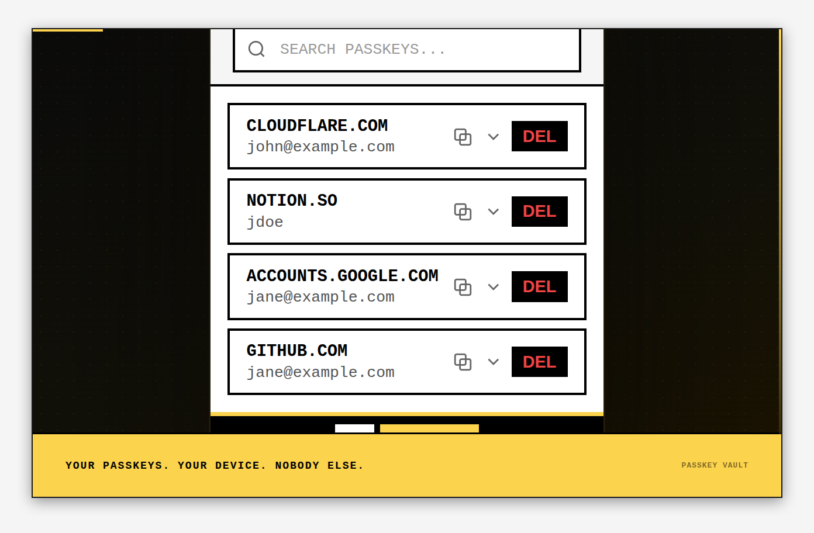
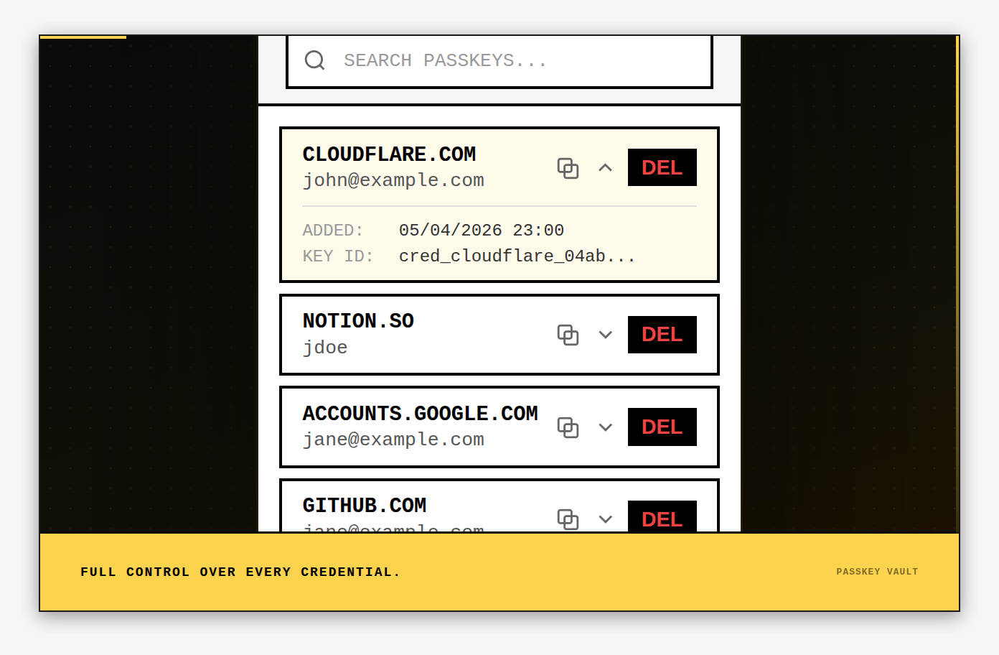
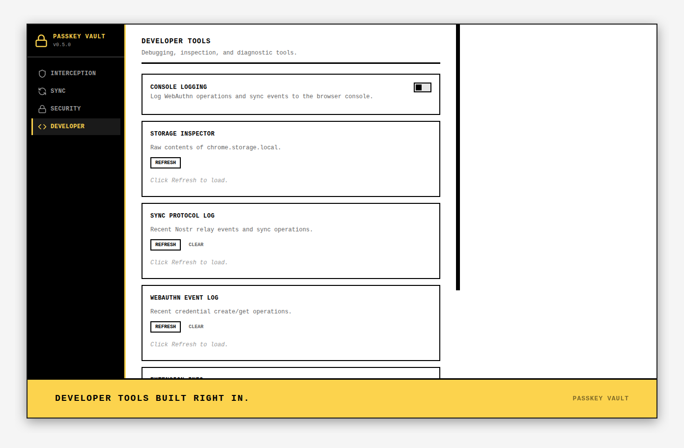
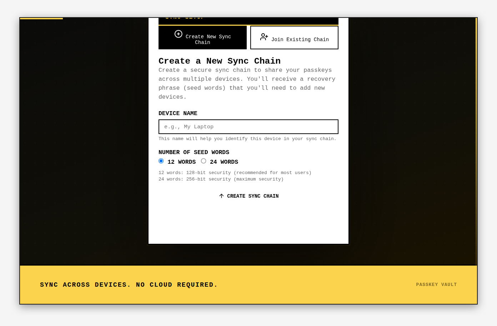

# PassKey Vault

A browser extension that intercepts WebAuthn API calls and stores passkeys locally, bypassing the browser's native passkey UI. Works on **Chrome** (MV3) and **Firefox** (MV2).

[Install from Chrome Web Store](https://chromewebstore.google.com/detail/passkey-vault/lopekoolgoijpmaidblgfgelbkfkgmod)

---

## Screenshots










---

## Features

- **WebAuthn interception** — captures `navigator.credentials.create()` and `navigator.credentials.get()` before the browser handles them
- **Local storage** — passkeys stay in browser local storage, no external server
- **Backup & import** — export all passkeys (including private keys) as a JSON file, import on another device
- **Cross-device sync** — optional Nostr-based sync chain using a BIP-39 seed phrase
- **Emergency access** — standalone recovery page for vault management without the extension popup
- **Chrome + Firefox** — single codebase, separate manifests

---

## Installation

### Chrome Web Store

[Download PassKey Vault](https://chromewebstore.google.com/detail/passkey-vault/lopekoolgoijpmaidblgfgelbkfkgmod)

### Build from source

Requires Node.js 18+.

```bash
git clone https://github.com/FenkoHQ/passkey-vault.git
cd passkey-vault
npm install

npm run build          # Chrome
npm run build:firefox  # Firefox
npm run build:all      # Both
```

**Load in Chrome:**
1. Open `chrome://extensions/`
2. Enable Developer mode
3. Click "Load unpacked" → select `dist/`

**Load in Firefox:**
1. Open `about:debugging#/runtime/this-firefox`
2. Click "Load Temporary Add-on..."
3. Select `dist-firefox/manifest.json`

---

## How it works

1. A content script injects into every page and overrides the native WebAuthn API
2. On `credentials.create()`, the background script generates an ECDSA P-256 key pair, creates a valid attestation response, and stores the passkey
3. On `credentials.get()`, it signs the challenge with the stored private key using proper CBOR encoding
4. The popup reads directly from `chrome.storage.local` — no background message passing for display

---

## Scripts

```bash
npm run build            # Build for Chrome
npm run build:firefox    # Build for Firefox
npm run build:all        # Build for both
npm run zip              # Build Chrome + create ZIP
npm run zip:firefox      # Build Firefox + create ZIP
npm run zip:all          # Build both + create both ZIPs
npm run clean            # Remove dist directories
npm run test             # Run tests
npm run lint             # Run ESLint
npm run typecheck        # TypeScript check
npm run version:bump     # Sync version across all manifests (run before tagging)
npm run capture          # Re-generate screenshots and demo video
```

---

## Releasing

```bash
npm run version:bump 0.5.0
git add package.json src/manifest.json src/manifest.firefox.json
git commit -m "bump to 0.5.0"
git tag v0.5.0 && git push && git push --tags
```

The CI pipeline builds both extensions, publishes to the Chrome Web Store, and creates a GitHub release with both ZIPs attached.

---

## Project structure

```
src/
├── background/         # Service worker / background script
├── content/            # Content script + WebAuthn injection
├── crypto/             # BIP-39, ECDSA, AES-GCM, secure storage
├── sync/               # Nostr-based sync service
├── ui/                 # popup, options, import, sync-setup, sync-settings, emergency
├── manifest.json       # Chrome MV3
└── manifest.firefox.json
```

---

## Security

- Private keys are stored unencrypted in `chrome.storage.local`
- Export files contain private keys — treat them like passwords
- This is a research/developer tool, not a production credential manager

---

## License

MIT
